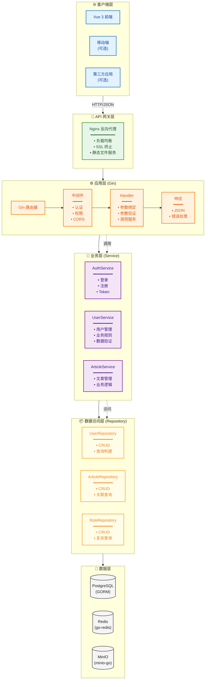
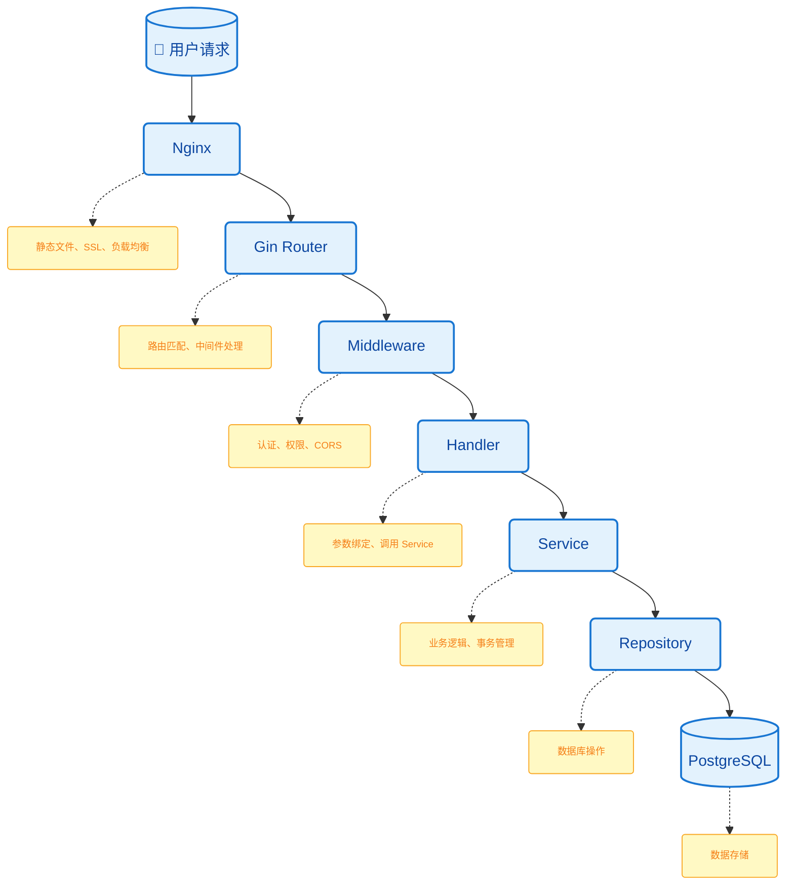

# 架构概览

::: tip 💡 怎么读这页
这一页是整章的"地图"。先看 Mermaid 图建立全局印象，再看每层的代码示例和设计原则。第一次读不需要记住所有细节，后面实际编码时会反复回来查阅。
:::

## 页面导航

[[toc]]

## 系统架构

本教程采用经典的**分层架构**设计，确保代码的可维护性和可测试性。

::: tip 开发环境 vs 生产环境
在第 1-3 章的开发阶段，你通常会直接启动 Gin 服务进行调试；`Nginx` 更适合放在生产部署阶段统一处理反向代理、HTTPS 和静态资源分发。所以本页的系统架构图请理解为“**完整部署形态**”，不是说本地一开始就必须先配好 Nginx。
:::



---

## 分层架构详解

### 1. Handler 层（控制器）

**目录**: `internal/api/v1/`

**职责**:
- 处理 HTTP 请求和响应
- 参数绑定和验证
- 调用 Service 层
- 格式化响应数据

**代码示例**:

```go
// internal/api/v1/user.go
package v1

type UserHandler struct {
    userService *service.UserService
}

// List 获取用户列表
func (h *UserHandler) List(c *gin.Context) {
    // 1. 绑定参数
    var req service.ListRequest
    if err := c.ShouldBindQuery(&req); err != nil {
        response.Error(c, err)
        return
    }

    // 2. 调用服务
    users, total, err := h.userService.List(c.Request.Context(), &req)
    if err != nil {
        response.Error(c, err)
        return
    }

    // 3. 返回响应
    response.Page(c, users, total, req.Page, req.PageSize)
}
```

**设计原则**:
- ✅ 薄层设计 - 只处理 HTTP 相关逻辑
- ✅ 不包含业务逻辑
- ✅ 统一错误处理
- ✅ 统一响应格式

---

### 2. Service 层（业务逻辑）

**目录**: `internal/service/`

**职责**:
- 实现业务逻辑
- 协调多个 Repository
- 事务管理
- 调用外部服务

**代码示例**:

```go
// internal/service/user.go
package service

type UserService struct {
    userRepo *repository.UserRepository
    roleRepo *repository.RoleRepository
    logger   *zap.Logger
}

// Create 创建用户
func (s *UserService) Create(ctx context.Context, req *CreateRequest) error {
    // 1. 业务验证
    if err := s.validateUsername(req.Username); err != nil {
        return err
    }

    // 2. 检查用户是否存在
    exists, err := s.userRepo.ExistsByUsername(ctx, req.Username)
    if err != nil {
        return err
    }
    if exists {
        return ErrUserAlreadyExists
    }

    // 3. 创建用户
    user := &model.User{
        Username: req.Username,
        Password: s.hashPassword(req.Password),
    }

    // 4. 保存到数据库
    return s.userRepo.Create(ctx, user)
}
```

**设计原则**:
- ✅ 包含业务规则
- ✅ 事务边界管理
- ✅ 可独立测试
- ❌ 不包含 HTTP 相关逻辑

---

### 3. Repository 层（数据访问）

**目录**: `internal/repository/`

**职责**:
- 数据库 CRUD 操作
- 复杂查询构建
- 数据模型转换

**代码示例**:

```go
// internal/repository/user.go
package repository

type UserRepository struct {
    db *gorm.DB
}

// FindByID 根据 ID 查找用户
func (r *UserRepository) FindByID(ctx context.Context, id uint64) (*model.User, error) {
    var user model.User
    err := r.db.WithContext(ctx).First(&user, id).Error
    return &user, err
}

// ExistsByUsername 检查用户名是否存在
func (r *UserRepository) ExistsByUsername(ctx context.Context, username string) (bool, error) {
    var count int64
    err := r.db.WithContext(ctx).
        Model(&model.User{}).
        Where("username = ?", username).
        Count(&count).Error
    return count > 0, err
}
```

**设计原则**:
- ✅ 只包含数据访问逻辑
- ✅ 不包含业务逻辑
- ✅ 返回领域模型
- ❌ 不调用其他 Repository

---

### 4. Model 层（数据模型）

**目录**: `internal/model/`

**职责**:
- 定义领域实体和数据库映射
- 复用公共字段（如 ID、创建时间、更新时间）
- 承载与持久化相关的结构标签（如 `gorm`、`json`）

**代码示例**:

```go
// internal/model/user.go
package model

import "time"

type BaseModel struct {
    ID        uint64    `gorm:"primaryKey;autoIncrement" json:"id"`
    CreatedAt time.Time `json:"created_at"`
    UpdatedAt time.Time `json:"updated_at"`
}

type User struct {
    BaseModel
    Username string `gorm:"size:50;uniqueIndex;not null" json:"username"`
    Password string `gorm:"size:255;not null" json:"-"`
    Email    string `gorm:"size:100" json:"email"`
    Status   int    `gorm:"default:1" json:"status"`
}
```

**设计原则**:
- ✅ Model 负责“数据长什么样”
- ✅ Service 负责“业务规则是什么”
- ✅ Handler 优先使用请求/响应 DTO，避免直接暴露内部模型

---

## 推荐依赖方向

为了避免代码逐渐失控，建议从一开始就遵守下面这条依赖链：

```text
Handler  ->  Service  ->  Repository  ->  Model
```

补充说明：

- `Handler` 只依赖 `Service`
- `Service` 可以依赖多个 `Repository`
- `Repository` 依赖 `Model` 与数据库客户端
- `Model` 不反向依赖上层代码

这样做的好处是：后面无论你是补测试、换数据库、还是加后台管理前端，影响范围都会更可控

## 依赖注入

### 构造器注入模式

```go
// 1. Repository 层
func NewUserRepository(db *gorm.DB) *UserRepository {
    return &UserRepository{db: db}
}

// 2. Service 层
func NewUserService(
    userRepo *UserRepository,
    roleRepo *RoleRepository,
    logger *zap.Logger,
) *UserService {
    return &UserService{
        userRepo: userRepo,
        roleRepo: roleRepo,
        logger:   logger,
    }
}

// 3. Handler 层
func NewUserHandler(userService *service.UserService) *UserHandler {
    return &UserHandler{
        userService: userService,
    }
}

// 4. 初始化 (main.go 或 wire.go)
func main() {
    // 初始化依赖
    db := database.InitDB(cfg)
    userRepo := repository.NewUserRepository(db)
    roleRepo := repository.NewRoleRepository(db)
    userService := service.NewUserService(userRepo, roleRepo, logger)
    userHandler := v1.NewUserHandler(userService)

    // 注册路由
    r := gin.Default()
    r.GET("/api/v1/users", userHandler.List)
}
```

### 依赖关系图

```mermaid
flowchart TB
    %% 定义样式
    classDef dbFill fill:#E0E0E0,stroke:#616161,stroke-width:2px,color:#212121
    classDef repoFill fill:#FFF9C4,stroke:#F9A825,stroke-width:2px,color:#F57F17
    classDef serviceFill fill:#E1BEE7,stroke:#7B1FA2,stroke-width:2px,color:#4A148C
    classDef handlerFill fill:#FFCC80,stroke:#F57C00,stroke-width:2px,color:#E65100

    DB[(("Database<br/>(GORM)"))]:::dbFill

    subgraph Repos["Repositories"]
        UserRepo["UserRepository"]:::repoFill
        RoleRepo["RoleRepository"]:::repoFill
        ArticleRepo["ArticleRepository"]:::repoFill
    end

    UserService["UserService"]:::serviceFill

    UserHandler["UserHandler"]:::handlerFill

    DB --> UserRepo
    DB --> RoleRepo
    DB --> ArticleRepo

    UserRepo --> UserService
    RoleRepo --> UserService
    ArticleRepo -.-> UserService

    UserService --> UserHandler
```

---

## 数据流向

### 请求处理流程



---

## 与 Spring Boot 对比

### 分层架构对比

| Spring Boot | Gin | 说明 |
|-------------|-----|------|
| `@RestController` | Handler (API) | 控制器层 |
| `@Service` | Service | 业务层 |
| `@Repository` | Repository | 数据访问层 |
| `@Component` | - | 组件 |

### 依赖注入对比

**Spring Boot (自动注入)**:
```java
@Service
public class UserService {
    @Autowired
    private UserRepository userRepository;
}
```

**Gin (显式注入)**:
```go
func NewUserService(userRepo *UserRepository) *UserService {
    return &UserService{
        userRepo: userRepo,
    }
}
```

### 事务管理对比

**Spring Boot**:
```java
@Transactional
public void createUser(User user) {
    // 自动事务管理
}
```

**Gin**:
```go
func (s *Service) CreateUser(ctx context.Context, user *User) error {
    return s.db.Transaction(func(tx *gorm.DB) error {
        // 手动事务管理
        return nil
    })
}
```

---

## 设计决策

### 为什么选择分层架构？

**优势**:
- ✅ **可测试性** - 每层可独立测试
- ✅ **可维护性** - 层间变化互不影响
- ✅ **可扩展性** - 易于添加新功能
- ✅ **可重用性** - 服务可在不同接口间复用

**权衡**:
- ⚠️ 更多文件和目录
- ⚠️ 略微更多的样板代码
- ⚠️ 初始复杂度较高

### 为什么选择 Gin？

**优势**:
- ⚡ 高性能（基于 httprouter）
- 🎯 简洁专注
- 🔧 良好的中间件生态
- 👥 社区活跃

**与其他框架对比**:

| 框架 | 性能 | 学习曲线 | 功能丰富度 |
|------|------|----------|-----------|
| Gin | ⭐⭐⭐⭐⭐ | 简单 | 适中 |
| Echo | ⭐⭐⭐⭐⭐ | 简单 | 适中 |
| Beego | ⭐⭐⭐ | 中等 | 丰富 |
| Fiber | ⭐⭐⭐⭐⭐ | 简单 | 适中 |

---

## 错误处理策略

### 分层错误处理

```go
// Repository 层 - 返回原始错误
func (r *UserRepository) FindByID(ctx context.Context, id uint64) (*model.User, error) {
    var user model.User
    err := r.db.WithContext(ctx).First(&user, id).Error
    if err != nil {
        return nil, err
    }
    return &user, nil
}

// Service 层 - 包装为业务错误
var (
    ErrUserNotFound = errors.New("用户不存在")
    ErrUserExists   = errors.New("用户已存在")
)

func (s *UserService) GetUser(ctx context.Context, id uint64) (*model.User, error) {
    user, err := s.userRepo.FindByID(ctx, id)
    if err != nil {
        if errors.Is(err, gorm.ErrRecordNotFound) {
            return nil, ErrUserNotFound
        }
        return nil, err
    }
    return user, nil
}

// Handler 层 - 转换为 HTTP 响应
func (h *UserHandler) GetUser(c *gin.Context) {
    var req struct {
        ID uint64 `uri:"id" binding:"required"`
    }
    if err := c.ShouldBindUri(&req); err != nil {
        response.Error(c, response.InvalidParams)
        return
    }

    user, err := h.userService.GetUser(c.Request.Context(), req.ID)
    if err != nil {
        if errors.Is(err, ErrUserNotFound) {
            response.Error(c, response.NotFound)
        } else {
            response.Error(c, response.InternalServerError)
        }
        return
    }
    response.Success(c, user)
}
```

---

---

::: info 🧭 下一步
**[← 返回第二章](./)** **[继续阅读：目录结构 →](./directory-structure)**
:::